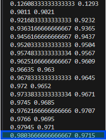

# README_jp.md

## 環境構築

```zsh
python3 -m venv .venv
source .venv/bin/activate
pip install -r requirements.txt
```

## 1. ファイルの説明

### neural_network/dataset/mnist.py

MNISTデータセットを読み込むための関数が定義されています。

load_mnist関数を使用して、MNISTデータを読み込みます。
normalize=Trueは画像データの正規化を行い、one_hot_label=Trueはラベルをone-hot表現で読み込む設定です。

### neural_network/two_layer_net.py

TwoLayerNetクラスが定義されています。
このクラスでは、2層のニューラルネットワークを構築し、学習や推論、勾配の計算を行います。
__init__メソッドでネットワークの構造を初期化し、重みやバイアスを設定します。
predictメソッドで入力データの推論を行い、lossメソッドで損失（クロスエントロピー誤差）を計算します。
accuracyメソッドで精度を評価し、numerical_gradientおよびgradientメソッドで勾配を計算します。

### neural_network/train_two_layer_net.py

ニューラルネットワークの訓練処理が記述されています。
MNISTデータセットを読み込み、TwoLayerNetクラスを用いてネットワークを初期化します。
ミニバッチを用いて指定したイテレーション数だけ学習を行い、途中経過と最終的な精度を表示します。

## 2. 使用方法

```zsh
cd neural_network
python3 train_two_layer_net.py
```

train_network.pyを実行すると、TwoLayerNetを用いたニューラルネットワークの訓練が開始されます。
イテレーションごとに損失が表示され、訓練データとテストデータの精度が定期的に評価されます。

最終的なテストデータの精度が表示されるので、ネットワークの性能を評価します。



|  |  |
| :--- | :--- |
| `左` | 訓練データに対する精度 |
| `右` | テストデータに対する精度 |